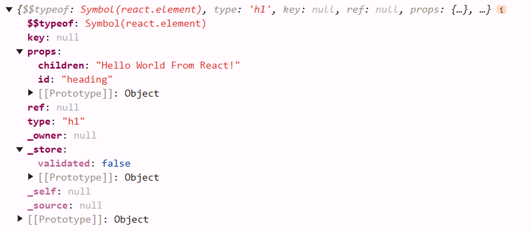

### Creating a basic web page using HTML

```html
<!DOCTYPE html>
<html lang="en">
  <head>
    <meta charset="UTF-8" />
    <meta name="viewport" content="width=device-width, initial-scale=1.0" />
    <title>Document</title>
  </head>
  <body>
    <div id="root">
      <h1>Hello World!</h1>
    </div>
  </body>
</html>
```

- This is a basic web page that display the heading - **"Hello World!"**
- Most of the boiler plate code for creating this web page can be generated using the **"Emmet"**, `html:5`.

### Creating a basic web page using HTML & JavaScript

```html
<!DOCTYPE html>
<html lang="en">
  <head>
    <meta charset="UTF-8" />
    <meta name="viewport" content="width=device-width, initial-scale=1.0" />
    <title>Document</title>
  </head>
  <body>
    <div id="root"></div>
    <script>
      const heading = document.createElement("h1");
      heading.innerHTML = "Hello World From JavaScript!";

      const root = document.getElementById("root");
      root.appendChild(heading);
    </script>
  </body>
</html>
```

- Now we have created a similar web page, but this time, rendering of the heading is done through the **JavaScript**.

### Creating a basic web page using React

```html
<!DOCTYPE html>
<html lang="en">
  <head>
    <meta charset="UTF-8" />
    <meta name="viewport" content="width=device-width, initial-scale=1.0" />
    <title>Document</title>
  </head>
  <body>
    <div id="root"></div>
    <script
      crossorigin
      src="https://unpkg.com/react@18/umd/react.development.js"
    ></script>
    <script
      crossorigin
      src="https://unpkg.com/react-dom@18/umd/react-dom.development.js"
    ></script>

    <script>
      const heading = React.createElement("h1", {}, "Hello World From React!");
      const root = ReactDOM.createRoot(document.getElementById("root"));
      root.render(heading);
    </script>
  </body>
</html>
```

- `https://unpkg.com/react@18/umd/react.development.js` - Available in this URL is the code of React written in JavaScript (React is a JavaScript library).
- To get a better peek into the available functionalities, open browser's `console` and type `React`.
- `https://unpkg.com/react-dom@18/umd/react-dom.development.js` - While the first URL is core of React, this second URL is library to use React DOM.
- To get a better peek into the available functionalities, open browser's `console` and type `ReactDOM`.
- The reason why there are two separate URLs is because, React is not just used in browsers, it is also used in mobiles and other such notable scenarios.
- For this reason, React is separated into individual modules, based on the use cases, with the core module in one place.
- `const heading = React.createElement("h1", {}, "Hello World From React!");` - The second parameter `{}` which is a JavaScript object is used to pass attributes to the tag.
- `const heading = React.createElement("h1", {id:'heading'}, "Hello World From React!");` - This will give the `id`, `heading` to the `h1` tag.

**Note**: In a interactive web page with user inputs, nodes can be added/deleted from the DOM. This DOM manipulation is one of the most costly/heavy operation in the browser. The frontend libraries(including React) most of the time have a core objective of **optimizing DOM manipulation**.

```javascript
const heading = React.createElement(
  "h1",
  { id: "heading" },
  "Hello World From React!"
);
console.log(heading);
```

- `heading` is a React Element, which again is a normal JavaScript object.
- The above code will give the below output on console.



### Creating nested HTML elements using React

```html
<div id="parent">
  <div id="child">
    <h1>Creating nested HTML elements using React</h1>
  </div>
</div>
```

```javascript
const parent = React.createElement(
  "div",
  { id: "parent" },
  React.createElement(
    "div",
    { id: "child" },
    React.createElement("h1", {}, "Creating nested HTML elements using React")
  )
);

root.render(parent);
```

- If we want to add more tags inside the `div#child` we can wrap them inside an array.

```html
<div id="parent">
  <div id="child">
    <h1>Creating nested HTML elements using React</h1>
    <h2>Second element</h2>
  </div>
</div>
```

```javascript
const parent = React.createElement(
  "div",
  { id: "parent" },
  React.createElement("div", { id: "child" }, [
    React.createElement("h1", {}, "Creating nested HTML elements using React"),
    React.createElement("h2", {}, "Second element"),
  ])
);
```

- This way of doing gives us an warning. _(Details about this error not covered in course so far)_


- Now to extend it further and creating a below HTML structure.

```html
<div id="parent">
    <div id="child">
      <h1>Creating nested HTML elements using React</h1>
      <h2>Second element</h2>
    </div>
    <div id="child2">
      <h1>Creating nested HTML elements using React</h1>
      <h2>Second element</h2>
    </div>
  </div
```

- We can write something like below.

```javascript
const parent = React.createElement("div", { id: "parent" }, [
  React.createElement("div", { id: "child" }, [
    React.createElement("h1", {}, "Creating nested HTML elements using React"),
    React.createElement("h2", {}, "Second element"),
  ]),
  React.createElement("div", { id: "child2" }, [
    React.createElement("h1", {}, "Creating nested HTML elements using React"),
    React.createElement("h2", {}, "Second element"),
  ]),
]);
```

- We can observe from this as the elements increase, writing code this way can be length and messy.
- To combat this we can use `jsx`.

### Order of script tags.

```html
<body>
  <div id="root"></div>
  <script
    crossorigin
    src="https://unpkg.com/react@18/umd/react.development.js"
  ></script>
  <script
    crossorigin
    src="https://unpkg.com/react-dom@18/umd/react-dom.development.js"
  ></script>

  <script src="App.js"></script>
</body>
```

- The order of `script` tags matter. This is because, one `script` tag is using the code from the above `script` tag.

### Rerendering the element

```javascript
const heading = React.createElement("h1", {}, "Hello World From React!");
const root = ReactDOM.createRoot(document.getElementById("root"));
root.render(heading);
```

- Here we are rendering `h1` into the `div#root`. But if there is already existing content in `div#root`, rendering will replace this existing content with the `h1`.

### Use case of React

- When we are using the `script` tags to inject React into our application, this shows we can use React in small parts of out application.
- In brief we can build an application with plain JavaScript and using React to render just parts/sections of that application.

### CDN vs npm

- Using CDN links to use a library may not be the optimal way. Firstly it is a costly operation, we need to fetch the source code from the specified URL.
- If the source code is present in our `node_modules`, it will be easy for the application to access the code locally.
- Also as we can see from the URL we are fetching React 18, if the version changes, we might have update the links manually.
- Another issue is if the CDN server is crashed, as our application is fetching code from it, our application will now be broken.
