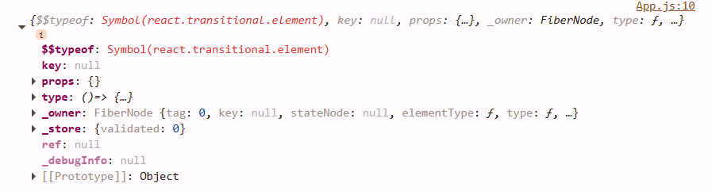

### <div align="center">Everything that we can do using `REACT`, can be done using regular `HTML` & `JavaScript`.</div>

## <div align="center">THEN WHY REACT?</div>

- Not just react, the reason we use any frameworks/libraries is because it improve developers experience.

## Cleaning the `app`

- So far we have included all the components inside the `app.js` file. In a real-time case we have a lot of components and this will make the `aap.js` a whole lot messy.
- To resolve this we can create individual files for each component.
- Now when we create the component files the extension can be `.js` or `.jsx` or `.tsx` if in TypeScript. It doesn't matter what file type it is.

## Importing and Exporting files.

- Now that we have successfully isolated components into separate files into different folder, to be able to use these `components` inside `app.js` we should `export` them from their files and `import` them into `app.js`

#### /src/components/Header.js

```javascript
export default Header = () => {
  return <div className="header"></div>;
};
```

#### /src/app.js

```javascript
import React from "react";
import ReactDOM from "react-dom/client";
import Header from "./Components/Header";
//import Header from "./Components/Header.js"; We can ignore the file extension after "Header" and it would still work.

const AppLayout = () => {
  return (
    <div id="app">
      <Header />
    </div>
  );
};

const root = ReactDOM.createRoot(document.getElementById("root"));

root.render(<AppLayout />);
```

## Cleaning the `app` cont'd.

- It is not a good practice to keep constant values in component files, for eg: media-urls, json hard coded values.
- One of the best practice is to create a separate folder - **utils**.

#### src/utils/constant.js

```javascript
export const MEDIA_ASSETS_URL =
  "https://media-assets.swiggy.com/swiggy/image/upload/fl_lossy,f_auto,q_auto,w_660/";
export const LOGO_URL =
  "https://marketplace.canva.com/EAGXsRURT9o/1/0/1200w/canva-yellow-and-brown-kitchen-food-logo-DRT6KFcL0ts.png";
```

- As you can see here instead of regular **default export** we are using **named export** as we have to export multiple values from the same file.
- **Named imports** are enclosed in curly braces (`{}`) as seen below.

#### src/components/RestaurantCard.js

```javascript
import { MEDIA_ASSETS_URL } from "../utils/constant";
```

#### src/components/Header.js

```javascript
import { LOGO_URL } from "../utils/constant";
```

## React Hooks

- Hooks can be used for multiple purposes. One such is to keep the UI and data in sync.
- Let's say I want to implement a button that filters top rated restaurants.

```javascript
{
  resList.restaurants.map((restaurant) => {
    return (
      <RestaurantCard key={restaurant.info.id} resData={restaurant.info} />
    );
  });
}
```

- Right now we are rendering the restaurants inside our data using the prop `resList`.
- Let's say we have a local array that holds the restaurants data copied from resList.

```javascript
import RestaurantCard from "./RestaurantCard";

export default Body = ({ resList }) => {
  let restaurantData = resList.restaurants;
  return (
    <div className="body">
      <div className="filter">
        <button
          className="filter-btn"
          onClick={() => {
            restaurantData = restaurantData.filter(
              (restaurant) => restaurant.info.avgRating > 4.1
            );

            console.log(restaurantData);
          }}
        >
          Top Rated
        </button>
      </div>
      <div className="res-container">
        {restaurantData.map((restaurant) => {
          return (
            <RestaurantCard
              key={restaurant.info.id}
              resData={restaurant.info}
            />
          );
        })}
      </div>
    </div>
  );
};
```

- Now in this implementation we used a local array to hold the restaurants.
- We also changed the `Top Rated` button, so that when we click it the array will be updated to only restaurants with rating greater than 4.1.
- Now we can also notice that even though the values inside the `restaurantData` are updated, the UI still remains the same.
- This is what the UI and data being in sync means.

### useState()

- `useState()` let's us create state variables to manage the state of the component(data and UI).

```javascript
import { useState } from "react"; //named import
```

- Now instead of a regular javascript variable we will use `useState()` to create a variable to hold restaurant data.

```javascript
const [restaurantData, setRestaurantData] = useState(resList.restaurants);
```

- We send the default value of `restaurantData` as `resList.restaurants` into the `useState()`.
- `setRestaurantData` is a function that can be invoked when we want to change the data of `restaurantData`. We need to pass the `restaurantData` into `setRestaurantData(restaurantData)` to change it.
- `setRestaurantData` is re-rendering the component each and every time it is being invoked

```javascript
const filteredRestaurantData = restaurantData.filter(
  (restaurant) => restaurant.info.avgRating > 4.1
);
setRestaurantData(filteredRestaurantData);
```

### Reconciliation Algorithm (React Fiber)

- In our scenario `Body` component has `RestaurantCard` components as it's children.
- Let's assume `Body` has seven children to start with and they will be rendered to three.
- What's happens in between is, React creates **Virtual DOM**
- **Virtual DOM:** Virtual DOM is a representation of actual DOM.
- Every component (eg: `<Body />`, `<Header />`, `<RestaurantCard />`), when logged onto console outputs a javascript object. This object is the virtual DOM.

```javascript
console.log(<Header />);
```



- Our difference algorithm finds the difference between old virtual DOM and new virtual DOM and only updates those changes onto actual DOM.
- In our case the `Body` component has seven `RestaurantCard` components in it's old virtual DOM and in it's new one it has only three.
- This difference of removing four child components is recognized by our difference algorithm and it will be updated inside our actual DOM.
- If this has to be done with actual DOM, two DOM trees has be compared and the difference needs to be updated this is generally very intensive task when compared to comparing two regular javascript objects.

**Note: Virtual DOM is a concept that has been existed for very long time. But in react they took this Virtual DOM and developed algorithms around it to make it's manipulation efficient.**