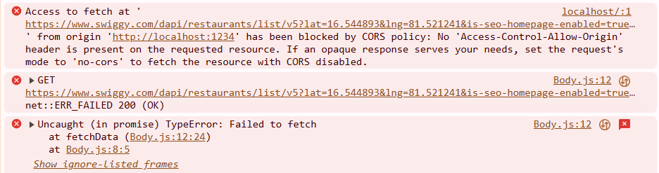

## Network Communication with React

- Up until this point, we have used local restaurant data to render our UI.
- Let's now try to fetch real-time data by making API requests and use the data to render the UI.
- We can do this whole process in two different ways

1. Load the page -> Make the API calls -> Render the UI
2. Load the page -> Initial render of the UI -> Make API calls -> Re-render the UI with data.

- The second approach though it seems complex, it is best when using React as it promotes UX.
- Also as react has very fast renders the two time rendering of UI is faster than normal.

## `useEffect`

- `useEffect` is another React hook which is also a regular javascript function.
- It takes to arguments:
  - An arrow function (callback)
  - A dependency array
- The callback function is called **after** the component is rendered.

```javascript
useEffect(() => {
  console.log("Component Rendered");
}, []);

console.log("Component is Rendering");
```

- Let's assume inside the `Body` component we have the above piece of code.
- On the console `Component is Rendering` followed by `Component Rendered`.
- This is because the `useEffect` executes the callback only after the component is rendered.

```
Component is Rendering
Component Rendered
```

- This particular functionality of `useEffect` can be used to fetch data after the component is rendered.
- We can fetch data inside the callback.

```javascript
useEffect(() => {
  fetchData();
}, []);

const fetchData = async () => {
  const data = await fetch(
    "https://www.swiggy.com/dapi/restaurants/list/v5?lat=16.544893&lng=81.521241&is-seo-homepage-enabled=true&page_type=DESKTOP_WEB_LISTING"
  );
  const json = await data.json();
  console.log(json);
};
```

- Here we are trying to make a network request after the component is rendered.
- Even though everything seems perfect, it will give an error.

  

- One way to resolve this error is using a proxy server.
- Install `express cors axios` in your project and with the combination of these create a proxy server in the root of your project

#### proxy.js

```javascript
const express = require("express");
const cors = require("cors");
const axios = require("axios");

const app = express();
app.use(cors());

const SWIGGY_HOME_API =
  "https://www.swiggy.com/dapi/restaurants/list/v5?lat=16.544893&lng=81.521241&is-seo-homepage-enabled=true&page_type=DESKTOP_WEB_LISTING";

app.get("/api/swiggy", async (req, res) => {
  try {
    const response = await axios.get(SWIGGY_HOME_API, {
      headers: {
        "User-Agent":
          "Mozilla/5.0 (Windows NT 10.0; Win64; x64) AppleWebKit/537.36 (KHTML, like Gecko) Chrome/123.0.0.0 Safari/537.36",
        Referer: "https://www.swiggy.com/",
        "Accept-Language": "en-US,en;q=0.9",
      },
    });
    res.json(response.data);
  } catch (error) {
    console.error("Error while fetching the data from swiggy: ", error);
    res.status(500).json({ error: "Trouble fetching the restaurants data." });
  }
});

const PORT = 5000;
app.listen(PORT, () => {
  console.log(`Proxy server running on http://localhost:${PORT}`);
});
```

- What is this doing? We are creating a proxy server and using `localhost:5000` to host.
- Now from our frontend we can call the `localhost:5000/api/swiggy` and our proxy server will call the swiggy api.
- Focus must be kept on the headers being passed along with the request.

```javascript
const response = await axios.get(SWIGGY_HOME_API, {
  headers: {
    "User-Agent":
      "Mozilla/5.0 (Windows NT 10.0; Win64; x64) AppleWebKit/537.36 (KHTML, like Gecko) Chrome/123.0.0.0 Safari/537.36",
    Referer: "https://www.swiggy.com/",
    "Accept-Language": "en-US,en;q=0.9",
  },
});
```

- When you add the headers, you are essentially making your **HTTP request** look like it’s coming from a **real browser** (like Chrome or Firefox), instead of a program or bot (like Axios or cURL).
- The `User-Agent` header tells the server **which browser or client** is making the request.
- The `Referer` header tells the server **where the request is coming from**. 
- When you set the `Referer` to `https://www.swiggy.com/`, it indicates that the request originated from the **Swiggy homepage** or their official website, making the request look legitimate.
- Additional headers like `Accept-Language` tell the server **what language you prefer** for the response. Setting this to `en-US` (English) or the appropriate language helps the server understand that the request is coming from a real user who expects a response in a human-readable format.

----

- Now after setting up the proxy server we are able to make an API call to swiggy and fetch the restaurants data.
- To access the restaurants data from the response, we have to do a lot of chaining - `json.data.cards[1].card.card.gridElements.infoWithStyle.restaurants`
- This is considered not a good practice. Instead use optional chaining - `json.data?.cards[1]?.card?.card?.gridElements?.infoWithStyle?.restaurants`