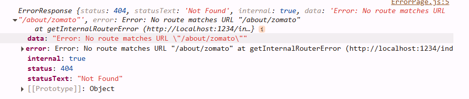

## Use cases with the dependency array from `useEffect`

1. If no dependency array is passed as argument into `useEffect`, the callback will be executed after each render of the component.

```javascript
useEffect(() => {
  console.log("No dependency array");
});
```

2. If the dependency array is empty, then the callback is executed only on the initial render.

```javascript
useEffect(() => {
  console.log("Empty dependency array");
}, []);
```

3. If we pass a variable inside the dependency array, the callback is executed every time the value of the variable is changed. In the below case, the callback will be executed every time the `loginBTN` value is changed.

```javascript
useEffect(() => {
  console.log("Dependency array with some value inside");
}, [loginBTN]);
```

## React Router

- Before we start creating router we need to create a routing configuration.
- Configuration is a piece of information that will define what will happen on a specific route.
- We will also use a `RouterProvider` which will be used together with routing configuration to render the React app.

#### ./app.js

```javascript
import { createBrowserRouter, RouterProvider } from "react-router-dom";

const appRouter = createBrowserRouter([
  {
    path: "/",
    element: <AppLayout />,
  },
  {
    path: "/about",
    element: <AppLayout />,
  },
]);

root.render(<RouterProvider router={appRouter} />);
```

- So far with these implementations, we are handling default route `("/")` and about route `(/about)`.
- If the user tries to access some random route like `("/zomato")`, as we are not defining any route handler, `react-router-dom` gives a **404 error page by default**.
- But we can also create our custom behavior using `errorElement`.

```javascript
const appRouter = createBrowserRouter([
  {
    path: "/",
    element: <AppLayout />,
    errorElement: <ErrorPage />,
  },
  {
    path: "/about",
    element: <About />,
  },
  {
    path: "/contact",
    element: <Contact />,
  },
]);
```

- Every time someone enters a wrong route, the `Errorpage` component will be rendered.

### `useRouteError`

- `useRouteError` is an hook given by `react-router-dom`. It will have detailed information about any errors while routing.

```javascript
import { useRouteError } from "react-router-dom";

export default ErrorPage = () => {
  const err = useRouteError();
  console.log(err);
  return ();
};
```


